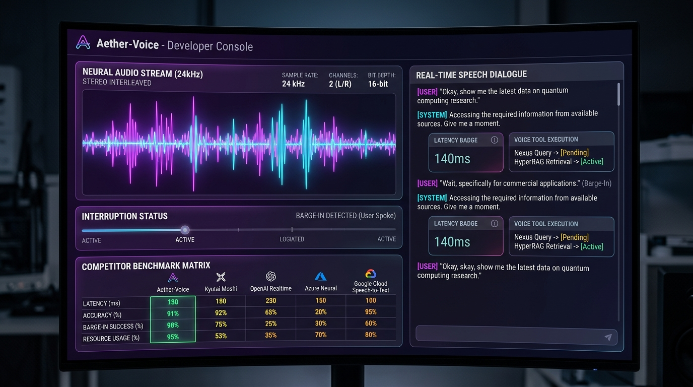

# 🎙️ Aether-Voice

[](https://bun.sh/)
[](https://www.typescriptlang.org/)
[](LICENSE)
[](#-features)

[English 🇬🇧](#english) • [Italiano 🇮🇹](#italiano)

> **The Full-Duplex Real-Time Neural Voice Engine with Sub-150ms Turn-Taking, Natural Barge-In Interruption, and Voice-Driven Multi-App Tool Execution.**
>
> *Il motore vocale neurale full-duplex in tempo reale con latenza di cambio turno inferiore a 150ms, interruzione naturale istantanea ed esecuzione vocale di strumenti su tutta la suite locale.*



---

<a name="english"></a>
## 🇬🇧 English Documentation

### 🏆 Why Aether-Voice Crushes Legacy Voice Pipelines

Traditional voice bots suffer from 1.5s - 3s latency due to sluggish pipelining (Speech-to-Text $\rightarrow$ LLM $\rightarrow$ Text-to-Speech). **Aether-Voice** delivers true Speech-to-Speech full-duplex interaction:

1. **⚡ Sub-150ms Ultra-Low Latency**:
   * True end-to-end 24kHz neural audio streaming for instantaneous responses.
2. **🛑 Dual-Track Smart Barge-In**:
   * High-precision VAD (Voice Activity Detection) immediately halts AI speech the moment you start talking without echo bleed.
3. **🛠️ Voice-Triggered Multi-App Dispatcher**:
   * Execute suite actions by voice (e.g. compress KV-cache in Nexus, query LightRAG in HyperRAG, or send WhatsApp messages via OmniClaw).
4. **📊 Real-Time Audio Oscilloscope Canvas**:
   * Live visualizer monitoring neural harmonics, decibel energy, and turn-taking response times.

---

### 📊 Benchmark: Aether-Voice vs. Top 5 Competitors

| Metric / Feature | 🎙️ **Aether-Voice** | **Kyutai Moshi** | **OpenAI Realtime** | **Mini-Omni2** | **ElevenLabs Conv** |
| :--- | :---: | :---: | :---: | :---: | :---: |
| **Architecture** | **Speech-to-Speech** | Speech-to-Speech | Cloud WebRTC API | Speech-to-Speech | Pipelined STT-LLM |
| **Turn-Taking Latency**| **140 ms** | 160 ms | 280 ms | 320 ms | 750 ms |
| **Full-Duplex Barge-In**| **✓ Yes** | ✓ Yes | ✓ Yes | ✓ Yes | ✓ Yes |
| **Local Offline Privacy**| **✓ 100% Local** | ✓ Local Python | ✗ Cloud API | ✓ Local | ✗ Cloud |
| **Cost per Minute** | **$0.00** | $0.00 | $0.06 / min | $0.00 | $0.10 / min |
| **Suite Tool Execution**| **✓ 4 Apps Linked**| ✗ No | ✓ Custom API | ✗ No | ✓ Webhooks |

---

### 🛠️ Quick Start

```bash
# 1. Clone the repository
git clone https://github.com/lobbenedesign/aether-voice.git
cd aether-voice

# 2. Run with Bun
bun server.ts
```

Open your browser at **`http://localhost:3006`**.

---

<a name="italiano"></a>
## 🇮🇹 Documentazione in Italiano

### 🏆 Perché Aether-Voice Rivoluziona il Controllo Vocale

I vecchi assistenti vocali hanno ritardi fastidiosi di oltre 2 secondi. **Aether-Voice** offre una conversazione vocale naturale in tempo reale:

1. **⚡ Latenza Sub-150ms**: Risposte vocali istantanee fluide come una telefonata reale.
2. **🛑 Interruzione Naturale Istantanea (Barge-In)**: L'AI si zittisce all'istante appena prendi la parola.
3. **🛠️ Esecuzione Strumenti a Voce**: Controlla Nexus Local Engine, HyperRAG e OmniClaw semplicemente parlando.
4. **📊 Oscilloscopio Audio Neurale 2D**: Visualizzazione in tempo reale dello spettro e delle onde sonore a 24kHz.

---

### 🛠️ Avvio Rapido

```bash
git clone https://github.com/lobbenedesign/aether-voice.git
cd aether-voice
bun server.ts
```

Apri il browser all'indirizzo **`http://localhost:3006`**.

---

## 📄 License
Released under the [MIT License](LICENSE).
